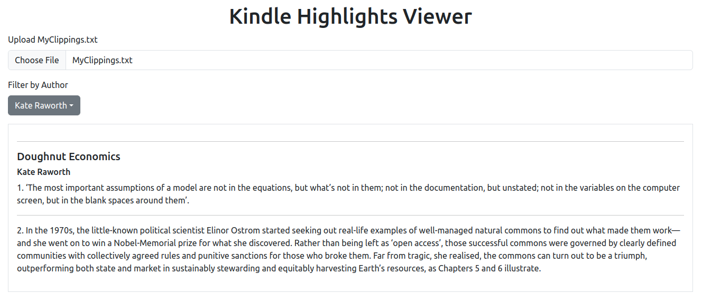

# QuoteBrowser

Browse clippings (highlights) saved from your Kindle eReader.

## Instructions

1. Open index.html in your web browser of choice
2. Upload MyClippings.txt (stored in the documents folder of your Kindle)

