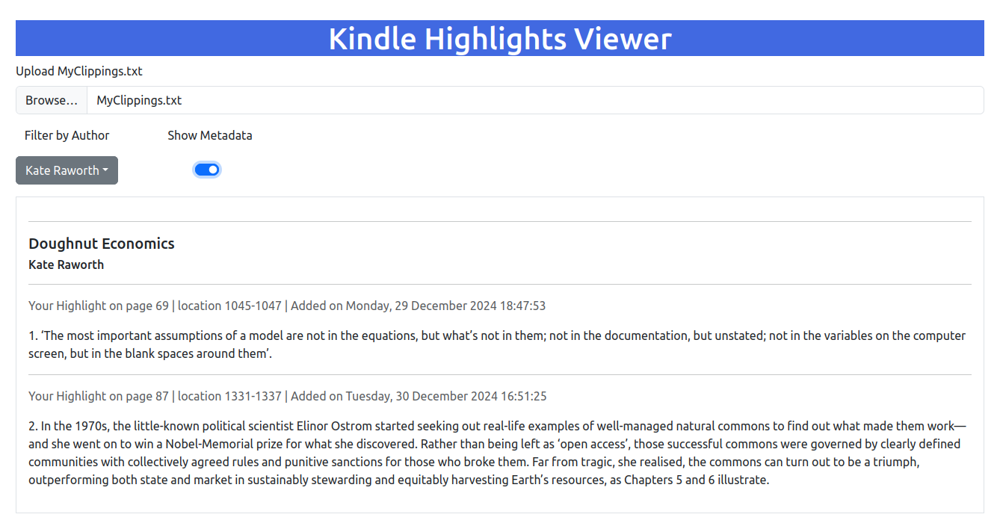

# QuoteBrowser

Browse clippings (highlights) saved from your Kindle eReader.

## Instructions

1. Go to [https://pdegen.github.io/QuoteBrowser/](https://pdegen.github.io/QuoteBrowser/)
2. Upload MyClippings.txt (stored in the documents folder of your Kindle)



## To do

- ~~Toggle displaying location and date~~
- ~~Share to Bluesky~~
- ~~Delete clipping~~
- Edit clipping/author/book title
- Save/overwrite MyClippings.txt
- Filter by book
- ~~Sort authors/titles by number of clippings~~
- Search clippings
- ~~Select clippings~~
- Select/deselect all/author/book
- Ensure compatibility if MyClippings.txt has different formats
- ~~Better mobile support~~

## Changelog

### [1.1.0] - 2025-03-06

- **Selection**: Filter selected highlights
- **Copy**: Copy highlight to clipboard
- **Share**: Share highlight to Bluesky

### [1.0.0] - 2025-03-02

- **Rebuild**: Complete rebuild in Vue.js

### [0.5.0] - 2025-01-30

- **Sorting**: Add sort dropdown menu; sort authors/titles by number of highlights.

### [0.4.0] - 2025-01-07

- **Sample Clippings**: Add button to upload sample clippings file.
- **Highlights Counter**: Count total number of highlights displayed.

### [0.3.0] - 2025-01-05

- **Delete**: Add delete and undo buttons. Note that this does not overwrite the original file.

### [0.2.0] - 2025-01-04

- **Metadata Toggle**: Toggle the visibility of the clipping's page, location, date, and time.

### [0.1.0] - 2025-01-01

- Initial release of the project.

## Recommended IDE Setup

[VSCode](https://code.visualstudio.com/) + [Volar](https://marketplace.visualstudio.com/items?itemName=Vue.volar) (and disable Vetur).

## Type Support for `.vue` Imports in TS

TypeScript cannot handle type information for `.vue` imports by default, so we replace the `tsc` CLI with `vue-tsc` for type checking. In editors, we need [Volar](https://marketplace.visualstudio.com/items?itemName=Vue.volar) to make the TypeScript language service aware of `.vue` types.

## Customize configuration

See [Vite Configuration Reference](https://vite.dev/config/).

## Project Setup

```sh
npm install
```

### Compile and Hot-Reload for Development

```sh
npm run dev
```

### Type-Check, Compile and Minify for Production

```sh
npm run build
```

### Lint with [ESLint](https://eslint.org/)

```sh
npm run lint
```
