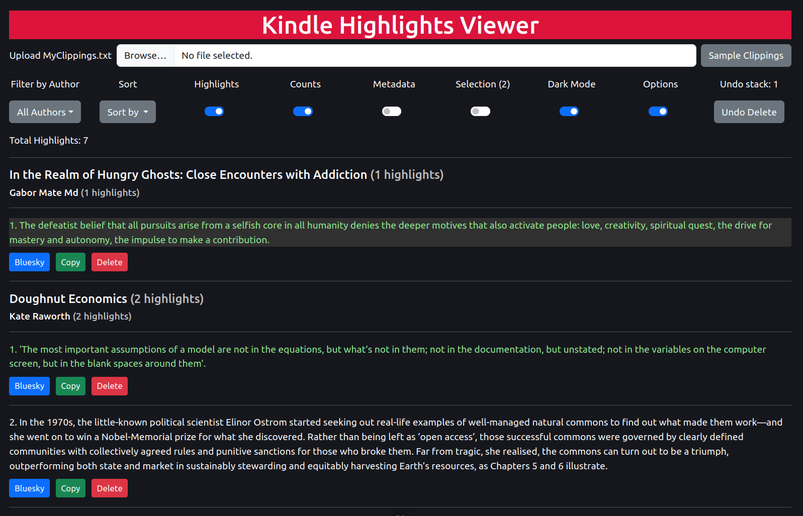

# QuoteBrowser

Browse clippings (highlights) saved from your Kindle eReader.

## Instructions

1. Go to [https://pdegen.github.io/QuoteBrowser/](https://pdegen.github.io/QuoteBrowser/)
2. Upload MyClippings.txt (stored in the documents folder of your Kindle)

## To do

- ~~Toggle displaying location and date~~
- Share to Bluesky
- ~~Delete clipping~~
- Edit clipping?
- Save/overwrite MyClippings.txt
- Filter by book
- ~~Sort authors/titles by number of clippings~~
- Search clippings
- Select clippings
  - Display only selected clippings
- Improve performance when editing clippings
  - Use React to only re-render changed DOM components

## Changelog

### [0.5.0] - 2025-01-30

**Added**

- **Sorting**: Add sort dropdown menu; sort authors/titles by number of highlights.

### [0.4.0] - 2025-01-07

**Added**

- **Sample Clippings**: Add button to upload sample clippings file.
- **Highlights Counter**: Count total number of highlights displayed.

### [0.3.0] - 2025-01-05

**Added**

- **Delete**: Add delete and undo buttons. Note that this does not overwrite the original file.

### [0.2.0] - 2025-01-04

**Added**

- **Metadata Toggle**: Toggle the visibility of the clipping's page, location, date, and time.

### [0.1.0] - 2025-01-01

**Added**

- Initial release of the project.
